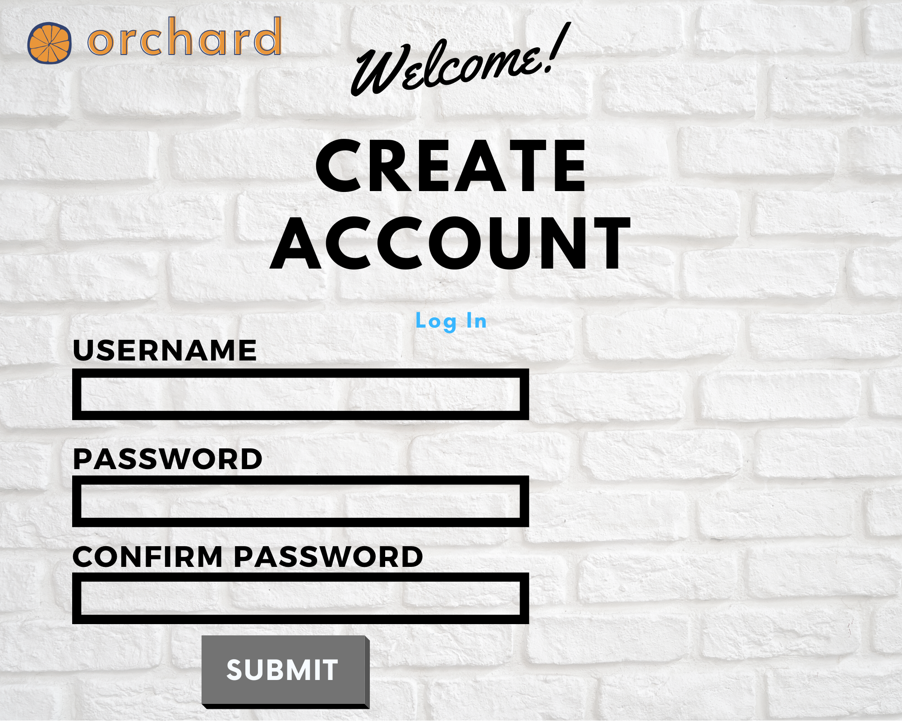
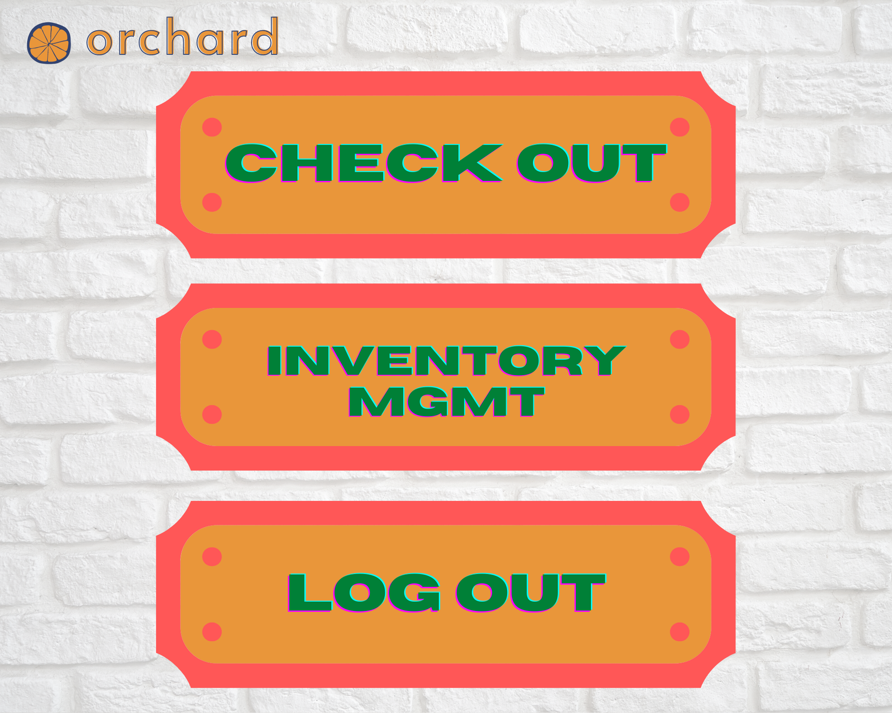
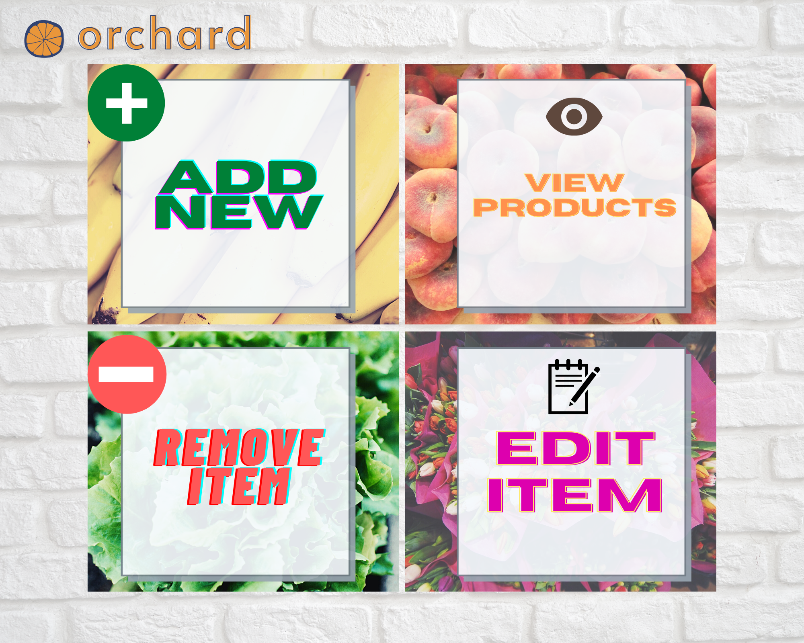
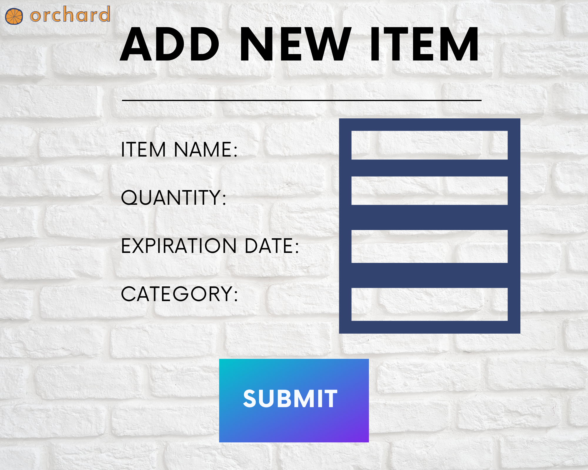

# Welcome to Orchard 👋

[](https://lbesson.mit-license.org/)

## User Story

```
As a farmer market vendor
I WANT a reliable and safe online application
SO THAT I can manage my inventory items
```

## Design

 <br>
 <br>
 <br>
 <br>
 <br>

## Developing

MVP

- Authenticate employees to access web application through a form
- Implementation of CRUD
- Automate sales transactions

Nice to Have

- Sale specials
- Creating API to generate photos of inventory items
- Adding metrics

## Technology Used

- Node.js
- Express
- React
- MySQL
- MVC Paradigm
- JavaScript

## Team Members

- 👤 **Juliet Goldstein**
- 👤 **Stephanie Landgraf**
- 👤 **Adrian Palacios**
- 👤 **Steve Munoz**

## 🤝 Contributing

Contributions, issues and feature requests are welcome!

## Show your support

Give a ⭐️ if this project helped you!

## 📝 License

Copyright © 2020 [Group 4](https://github.com/group4project2/Orchard).

This project is [MIT ](MIT License) licensed.
